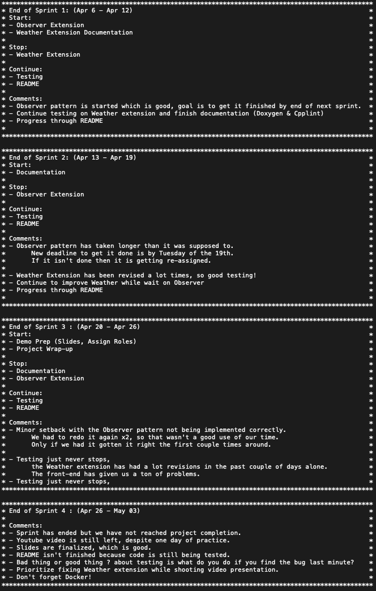

# Team-001-35-homework4
Abdullahi Nor *(nor00003)*,  
Isaac Mohammed Nur *(moha1187)*,  
Mohamed Mohamed *(moha1113)*,  
Muhammad Anwar *(anwar040)*

## **Project Overview**  ([Video Presentation](https://www.youtube.com/watch?v=ScLrya-_9W0))
> The "*Drone Simulation System*" allows you to schedule trips around the UMN campus, it is designed to pick up and drop off robots from one location to another. The system has a weather feature that effects the simulation as it goes on and also has a notification system to notify you of events in the simulation.
###### [Presentation Slides](media/Presentation.pdf)

## How to run the simulation
```bash
docker run --rm -it -p 8081:8081 anwar040/hw4_sim
```
It may say that it's unable to find the image locally, that's fine as long as it still pulls the image down.  

Check to see that your container is running with:
```bash
docker ps
```

If there's a container listed, then that means everything works!  You can now end this container process with:
```bash
docker kill <CONTAINER ID>
```
`<CONTAINER ID>` can be copied from the result of your previous `docker ps` call  

To view the dockerhub repo, follow this [link](https://hub.docker.com/r/anwar040/hw4_sim).

### 3D Visualization
You will be able to watch the simulation of the drone and the passenger here http://localhost:8081.

*Note: 8081 will depends on what port you used. If you use port 8082, then it will be http://localhost:8082 instead.*

### Schedule
You will be able to schedule the robots for a ride in this page http://localhost:8081/schedule.html. 

Type passenger name, select start and end destination, and press `Schedule Trip` button to schedule a trip. 

Now go to the 3D Visualization page and select the view of the entities on top right corner.

### Data Flow

Simple top overview of how/where the data flow in this program can be seen [here](media/UML.png).
****

## What does the simulation do specifically?
> The drone is responsible for picking up and dropping off robots. When a trip is scheduled, the drone flies straight towards the robot in order to pick it up. Upon picking up the robot, the drone follows a path to the robot's destination in order to drop it off. The path is specified by the user scheduling the trip. There are 3 different routing strategies to choose from, "*AStar, DFS, and Dijkstra*", these are popular path finding algorithms. Once the drone has reached it's final destination, it performs a celebration before moving on to the next trip. Celebrations consists of spinning, jumping or both. The user is also updated with the drone's current status through the notifications bar on the left-hand side of the simulation.  

> There are other entities as well, such as humans and satellite. The humans sole purpose is to move around the campus choosing their destinations randomly. The user can spawn humans at the click of a button, from the scheduler's page. The satellite on the other hand, cannot be spawned by the user. It is only spawned once and that is at the start of the program. The satellite's purpose is to orbit around the campus in a random fashion.  

> Weather has an effect on all of the aforementioned entities. There are 6 different types of weather in the system, "*normal, heavy snow, tornado, light rain, blazing hot, and hurricane*". The user can choose to see the physical state of the weather by clicking on the "**Show Weather**" checkbox, located at the top right-hand corner of the simulation. By doing so, the system will render a 3D model representing each weather.  

> All types of weather effect all types of entities in different ways. A drone isn't effected by snow the same way a human or a satellite is. When the weather is normal, all entities perform according to their default calibration. When the weather is snow, drone has performance and route changes. During a heavy snow weather, a drone can't move about the same way it normally does. So, it's speed decreases by fifty percent and it cannot fly straight towards a robot on pick up anymore. Whenever it snows, and the drone is on its way to pick up a robot, it must use a path, which is set to AStar by default. The drone still uses the user picked strategy to deliver the robot, but it uses AStar on pick up. The humans stop moving for safety precautions during snow and the satellite's speed decreases down to fifty percent.  

> During tornado weather, all entities stop moving, the satellite is raised high into space, so it becomes unviewable. The tornado moves around randomnly, whenever it comes into contact with a robot that has reached it's destination, the tornado deletes it. If the tornado makes contact with a human, it also deletes it. The tornado doesn't effect the drone, a robot that is scheduled for a trip, and a robot that is currently on its trip. 

> The light rain weather, doesn't effect the entities, it only introduces the theme of "light rain" to the simulation. This allows us to balance the system out, so the effects of "light rain" is the same as normal weather, except that there is a giant rain cloud in the middle of campus.  

> The blazing hot weather, is another extreme weather condition. This simulates a panic mode because everything is at an extremely high temperature, so all entities are in an urgent state. Their speed is doubled. The drone only flies straight, on pick up and on drop off. It ignores the path since they take longer to get to the robot and the destination. Last thing we want is to melt our robots into plastic.  

> The hurricane weather is a warning, there is a ten second delay before the actual hurricane appears. Which gives some time for the all entities to stop and take cover. While the hurricane is active the enities will stop moving and be unviewable to simulate the entities taking cover.  

> Each weather type occurs based on a probability, which is set in the Weather class. Each weather lasts sixty seconds, all changes are reverted before moving on to the next weather. So, the changes don't pile up.

****
## Weather Feature  
##### What does it do? Why is it significantly interesting? How does it add to the existing work?
> As the name suggests, the weather extension adds weather to the simulation. This feature is significantly interesting because it brings a real world challenge like forecast to the drone's behavior. Even though, this is not an accurate representation, it shows the countless possibilities behind product testing. How should the drone react under so-and-so weather conditions? Does it perform the way it should? To be able to test the quality of your product while cutting back on real-device testing can save one a lot of resources.
##### Which design pattern did you choose to implement it? Why?
> The design pattern of choice was __*Singleton*__, which allows the program to have up to one instance of a class. Weather effects the entire simulation and it's changes occurs throughout the entire program, so re-instantiating it everytime would do us no good. Rather it is better to have it in a global space where that same one-time created instance can be easily called upon.  
##### Instructions to use this feature
> Weather is updated on it's own, the weather is chosen based on a discrete distribution between the set of weather options *{ normal, snow, tornado, rain, hot, hurricane }*. As each weather is brought into play, their own graphics can also be displayed by toggling the "**Show Weather**" checkbox. Which makes it easier to determine the current forecast. There aren't any specific instructions, one should just interact with the simulation as they normally would and see the effects for themselves. Every time weather changes, the current weather should show up on the side in the notification system.

## Notification Feature
##### What does it do? Why is it significantly interesting? How does it add to the existing work?
> This feature displays current activity and the current weather on the notification bar. This feature makes the simulation navigation friendly, it allows the user to easily keep track of current scheduled trips, pick ups, and deliveries. This is significantly interesting because it improves on the user experience. It allows the user to stay updated with current events, if there are any trip delays due to the forecast, then the user is aware of such changes.
##### Which design pattern did you choose to implement it? Why?
> We chose to implement this extension through the observer pattern because it defines a mechanism that helps notify any events that happen to the object we are observing. In our case, it would be the drone and the weather.
##### Instructions to use this feature
> To see the activity, the user must first schedule a trip, after doing so, the simulation should take care of the rest and the user should be able to see live updates on the notification bar. Also there will be activity naturally because the weather is constantly changing and the notifications will pop up for each change

## Retrospective
#### Weekly Sprint Retrospective
<p align="center"><p>  

#### Comments
> "Something that we could have improved on is working as a team more and having more communication. We did better in terms of communication after a while but at the start I feel like we were kinda doing our own thing and I felt out of the loop sometimes."  

> "I think that we did a good job at meeting our deadlines with our sprints. We also did a good job at doing work over time instead of last minute".

> "We didn't do a good job breaking work flow down. Partial blame is how we spent our time during the initial lab stage. We never found a way to break down the labs, so that mindset found its way into the project. I personally felt that labs were something that couldn't be divided, since not everyone would have a good amount to work on. We tried different solutions like live share but our schedules never aligned, which was a big problem because not everyone had the same level comfortability with the code. Because we just never worked on the labs together. So, when we were hit with a far greater obstacle like a project that everyone had to contribute to, we were scrambling for ways to work together. In the end, it helped us become stronger towards working at the same goal!"

> "Everyone wanted to contribute! Which is a really good thing, because the team is on the same page. We didn't have a person going ghost or purposely trying to sabotage us. Everyone also understood their role, even if it wasn't the role they wanted. But, we understood what we needed to do in order to succeed. Not a lot people are willing to do that. I think communication was our greatest strength. Maybe not at the start but we adapted rather quickly. We constantly kept each other in the loop, we would update one another on things we were working on, or planned to work on. Above all we were all understanding of each others circumstances, which is a key to team success."

> "Developing stronger collaboration and communication from the start is one way we may have improved our performance. Although we eventually became more coordinated, we first worked more separately, which occasionally made me feel like I wasn't part of the group. We could have worked together more effectively as a team if we had built stronger communication lines and joint efforts from the beginning."

> "Despite the difficulties we encountered, our team excelled at meeting sprint deadlines and ensuring that assignments were finished on time. We also showed great work ethics by managing our time well and avoiding last-minute rushes to complete homework. We were able to maintain a continuous workflow and successfully complete our project goals thanks to this proactive strategy."
****
